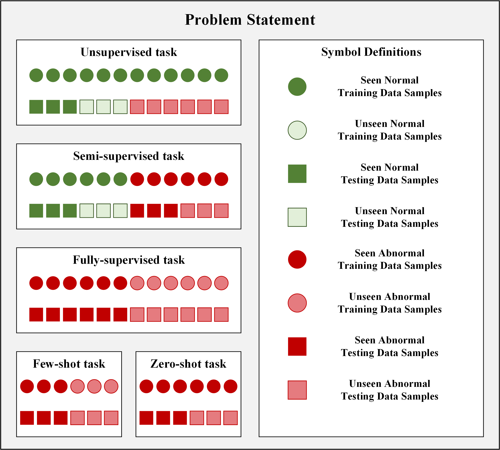

# CPSAD

## Data Link
The dataset is uploaded into Google Drive, and the source training data can be download in [here](https://drive.google.com/file/d/1Nasd7FhU0hqE7BzhwGm6UevbHMJjP4Ni/view?usp=sharing).

To ensure the fairness of the testing, we only released the original images of the testing data in [here]() and did not release the corresponding annotated data.

## Data Description
The data of CPSAD comes from ceramic packaging substrate samples in actual factory environments. As shown in Figure 1, these samples were selected during the punching hole, filling hole, and printing stage, representing actual production conditions and process changes. To ensure the accuracy and integrity of the data, we brought these samples into the laboratory environment for systematic data collection.

In fact, we can further divide the data into several categories: open circuits, short circuits, cracks, foreign matter, and pitting. From the perspective of research continuity and progression, we expect to gradually adapt the dataset to various subtasks, such as anomaly detection, semantic segmentation, and object detection.

## Benchmark Construction

"Minimum to maximum usage of data samples and annotations" is the logic to construct our benchmarks. In order to quickly build experiments to validate the effectiveness of the CPSAD dataset, we referred to many excellent open-source frameworks. As for the scenarios without a open-source framework, we replicated these algorithm on our dataset using the corresponding GitHub source code from the references.

In order to provide a more detailed explanation of the problem definitions involved in the tasks in our benchmark, we illustrate the usage of supervision and data by different tasks through Figure 3.

### Unsupervised task
We follow the pipeline of [anomalib](https://github.com/openvinotoolkit/anomalib) and [open-iad](https://github.com/M-3LAB/open-iad) to conduct our experiments about unsupervised task.

### Semi-supervised task
We follow the pipeline of [open-iad](https://github.com/M-3LAB/open-iad) to conduct our experiments about semi-supervised task.

### Zero-shot task
We have reproduced the zero-shot algorithm listed in the paper for CPSAD without referring to other publicly available frameworks. The links to all source codes are as follows：
- [SE](https://zimingzhang.wordpress.com/source-code/)
- [DASCN]()
- [CADA](https://github.com/edgarschnfld/CADA-VAE-PyTorch)
- [E-PGN](https://github.com/yunlongyu/EPGN)
- [TFVAEGAN](https://github.com/akshitac8/tfvaegan)
- [GEM-ZSL](https://github.com/osierboy/GEM-ZSL)
- [MSDN](https://github.com/shiming-chen/MSDN)
- [TransZero](https://github.com/shiming-chen/TransZero)
- [CC-ZSL](https://github.com/KORIYN/CC-ZSL)
- [Winclip](https://github.com/caoyunkang/WinClip)
- [AnoVL](https://github.com/hq-deng/AnoVL)
- [Anomalyclip](https://github.com/zqhang/AnomalyCLIP)
- 
We followed the original parameter settings in the paper and did not make any other changes.

### Few-shot task
We have reproduced the few-shot algorithm listed in the paper for CPSAD without referring to other publicly available frameworks. The concrete code used in our benchmark is uploaded in this issue.

### Fully-supervised task
We following the pipeline of [mmsegmentation](https://github.com/open-mmlab/mmsegmentation) to conduct our experiments about fully-supervised task.

## Evaluate your own method
We will publish the relevant evaluation code and evaluate the model online by uploading an Excel file like Kaggle or Ali Tianchi competition.

## Licenses
The dataset is released under the CC BY 4.0 license. All data collection processes are authorized by the relevant companies.
